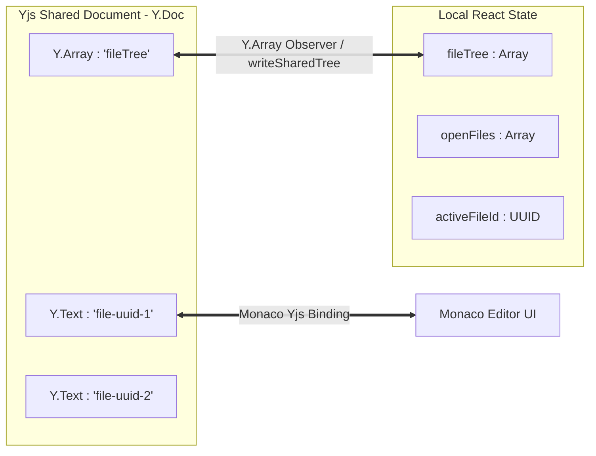
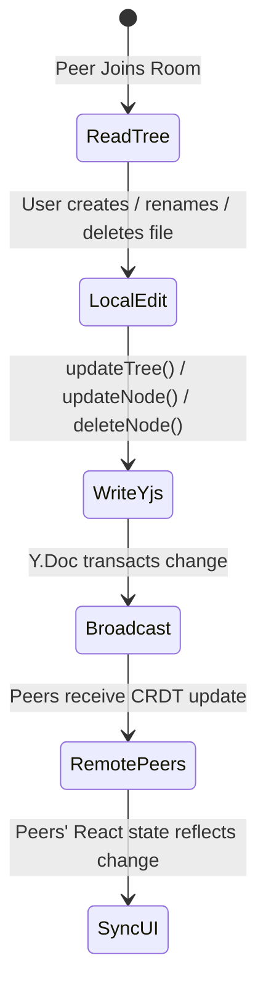

# 02. Collaborative CRDT Engine (Yjs & Synchronization)

This document explains the synchronization layer of CodeBoard, implemented inside `ProjectContext.jsx` using **Yjs** (Conflict-Free Replicated Data Types).

---

## 1. Why CRDTs over Database Polling?

In traditional collaborative applications, clients send API requests to update a server-side database. When multiple users edit code simultaneously, server-side locking or timestamp-based last-write-wins (LWW) policies cause **race conditions**, **cursor jumps**, and **overwritten files**.

CodeBoard solves this using **Yjs CRDTs**:
- **Decentralized State:** Every peer holds a mathematical replica of the shared document (`Y.Doc`).
- **Deterministic Convergence:** Operations commute—it does not matter what order updates arrive; all peers converge to an identical state.
- **Offline / Disconnect Resilience:** If a user temporarily drops offline, edits merge seamlessly once connectivity is re-established.

---

## 2. ProjectContext State Architecture

`ProjectContext.jsx` acts as the bridge between React's declarative state and Yjs's imperative data structures.



### Data Structures in `Y.Doc`
1. **`sharedFileTree` (`Y.Array`)**:  
   Stores the hierarchical file and folder structure. Every node has:
   - `id`: UUID (`crypto.randomUUID()`)
   - `name`: File or folder name
   - `type`: `"file"` | `"folder"`
   - `language`: Monaco language identifier (for files)
   - `children`: Nested array of nodes (for folders)
2. **`sharedDoc.getText('file-' + fileId)` (`Y.Text`)**:  
   A dedicated CRDT text structure for every file ID. Storing text per file ensures that editing one file never locks or impacts another file's synchronization.

---

## 3. Transaction Tagging & Loop Prevention

A common bug in collaborative React apps is the **infinite update loop**:
1. User A modifies React state.
2. An effect writes the update to Yjs.
3. The Yjs observer fires because the document changed.
4. The observer updates React state again, restarting the cycle.

### How CodeBoard Solves This:
When local actions modify state, CodeBoard updates React state and writes to Yjs **as separate, distinct steps outside of React functional state updaters** (to avoid React Strict Mode double-invocation side-effects):

```javascript
// Example from createFile() in ProjectContext.jsx
const nextTree = resolvedId
    ? updateTree(fileTree, resolvedId, (ch) => [...ch, newFile])
    : [...fileTree, newFile];

// 1. Update React local state
setFileTree(nextTree);

// 2. Update Yjs Shared Array
writeSharedTree(nextTree);
```

When an update originates from a remote peer, Yjs triggers the `observe` callback. If the transaction was initiated locally, the observer ignores it or handles it without echoing:

```javascript
sharedFileTree.observe((event, transaction) => {
    if (transaction.local) return; // Ignore our own local writes
    // Update local React state from remote peers
    setFileTree(sharedFileTree.toArray());
});
```

---

## 4. Collaborative File Tree Operations



### 1. File & Folder Creation (`createFile`, `createFolder`)
- Target folder is resolved by `folderId`.
- If `folderId` points to a file, CodeBoard automatically creates the new node at the workspace root.
- State is updated immediately in React for responsiveness, and pushed to `Y.Array` for peer distribution.

### 2. VS Code-Style Inline Rename (`renameNode`)
- Modifies the `name` property of the node matching `nodeId`.
- If the node is a file, it re-evaluates the language extension (e.g., `.py` -> `"python"`, `.java` -> `"java"`).
- Synchronizes both `fileTree` and any active `openFiles` tabs so open tabs reflect the new name immediately.

### 3. Recursive Deletion (`deleteNodeById`)
- Traverses the target node using `collectFileIds(target)` to find all file UUIDs contained within a deleted folder.
- Closes any active tabs that belonged to the deleted subtree.
- Removes the node from the tree and writes the cleaned array to Yjs.
