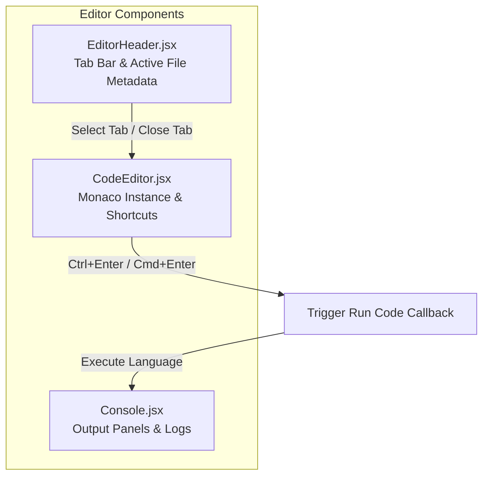
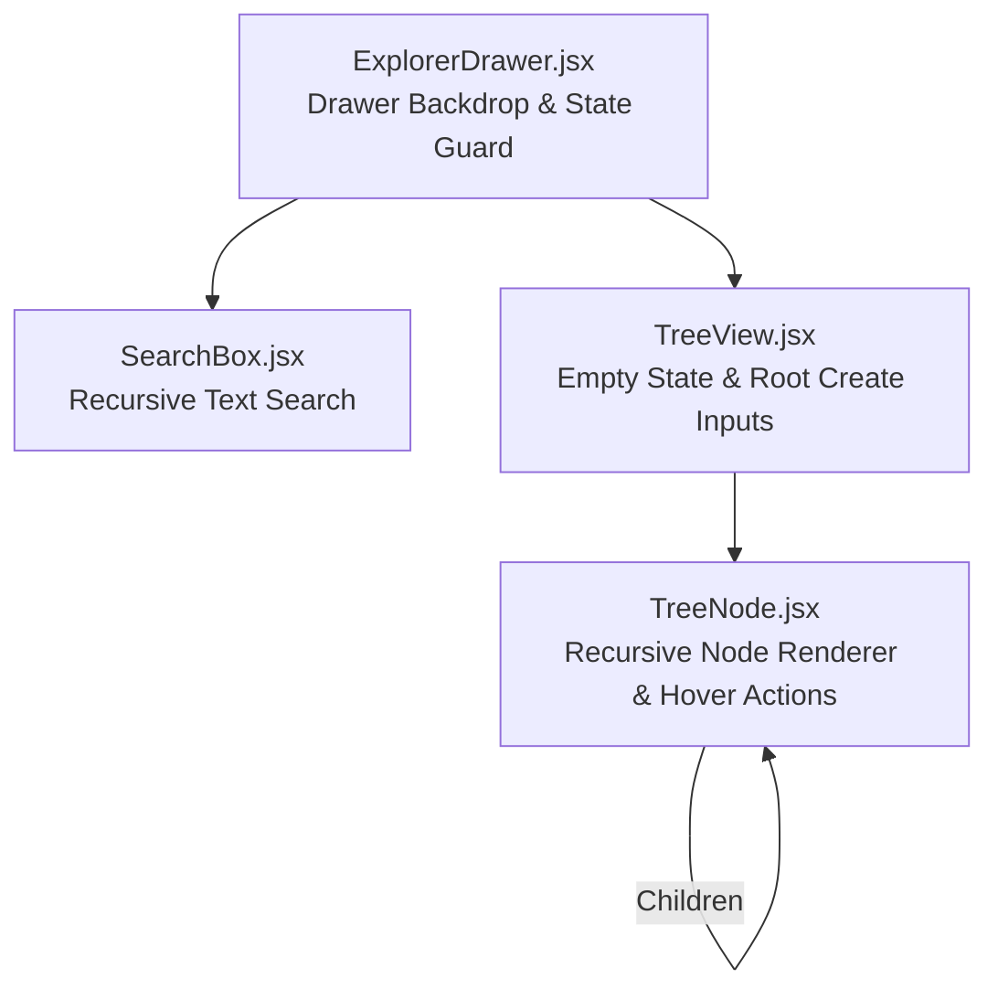
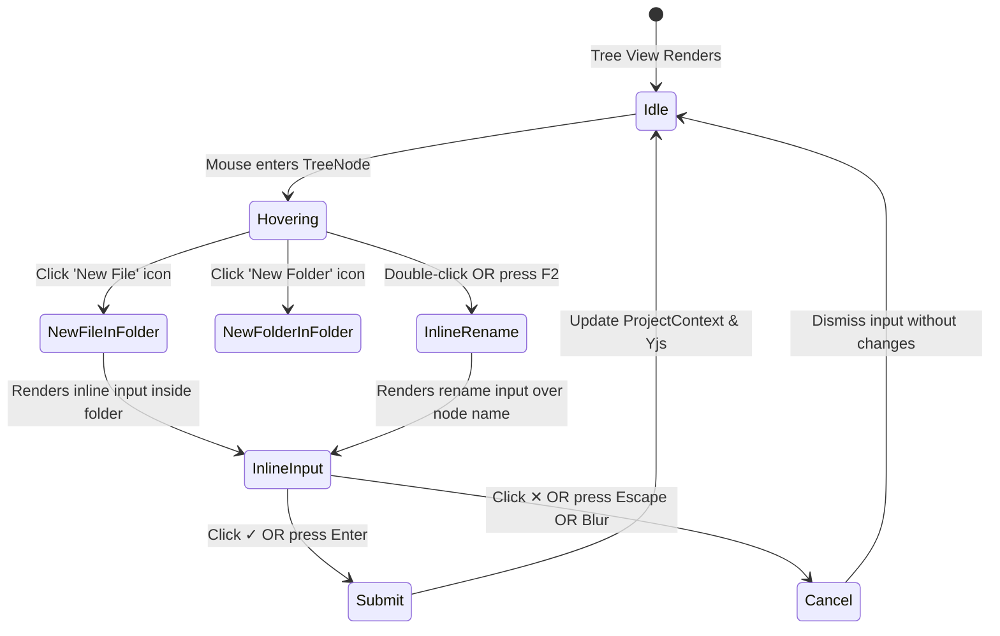

# 03. Monaco Editor & File Explorer Subsystem

This document covers the UI/UX and architectural implementation of CodeBoard's code editor and file explorer.

---

## 1. Monaco Code Editor Integration

CodeBoard integrates the **Monaco Editor** (the core editor of Microsoft VS Code) via `@monaco-editor/react`.

### Core Responsibilities of `CodeEditor.jsx`:
- **Syntax Highlighting:** Dynamically switches Monaco language mode based on the active file's extension (`getLanguage(filename)`).
- **CRDT Text Binding:** Connects the editor instance to the Yjs `Y.Text` document corresponding to `activeFileId`.
- **Keyboard Shortcuts:**
  - `Ctrl+Enter` (Windows/Linux) or `Cmd+Enter` (macOS): Triggers code execution immediately without clicking the Run button.
- **Cursor Awareness:** Preserves cursor positions and selection highlights during collaborative typing sessions.

### Core Responsibilities of `EditorHeader.jsx`:
- **Tab Bar Management:** Renders open files as tabs, supporting selection and tab closure (`closeFile`).
- **Language Status Pill:** Displays the active runtime badge (e.g., Python, Java, C++, TypeScript).
- **Run Button:** Displays an adaptive run button (e.g., `"Run Python"`, `"Run C++"`) that invokes the runtime engine.

---

## 2. File Explorer Architecture

The File Explorer provides a VS Code-style sidebar for creating, traversing, renaming, and deleting files and folders.

---

## 3. Inline Node Operations & UX Workflow

CodeBoard implements inline editing controls directly in the tree view to avoid modal dialogs.

### 1. Preventing Double-Create Bugs (`ExplorerDrawer.jsx` & `TreeNode.jsx`)
A common web editor bug occurs when an input has `onBlur={handleSubmit}` and the user presses `Enter`:
1. `onKeyDown` handles `Enter` and submits the form -> File is created.
2. Pressing `Enter` removes focus from the input, triggering `onBlur` -> Submits again -> Duplicate file is created.

#### CodeBoard's Solution:
- **`onBlur={handleCancelCreate}`:** Clicking outside an input cancels the action (matching VS Code's escape behavior).
- **Explicit `✓` and `✕` Buttons:** Attached with `onClick` handlers that execute before any blur events can interfere.

### 2. Recursive Search Filtering (`SearchBox.jsx` & `ExplorerDrawer.jsx`)
When a user types in the search bar:
- The tree is filtered recursively using `useMemo`.
- If a child file matches the search query, its parent folder is preserved in the hierarchy even if the folder name itself does not match.
- Non-matching empty branches are pruned from the view.

### 3. F2 / Inline Rename Workflow (`TreeNode.jsx`)
- Pressing `F2` or clicking Rename in the context menu toggles `isEditing = true`.
- An inline text input replaces the node's label.
- On submit, `renameNode(nodeId, newName)` updates both the file tree and any open tabs.
