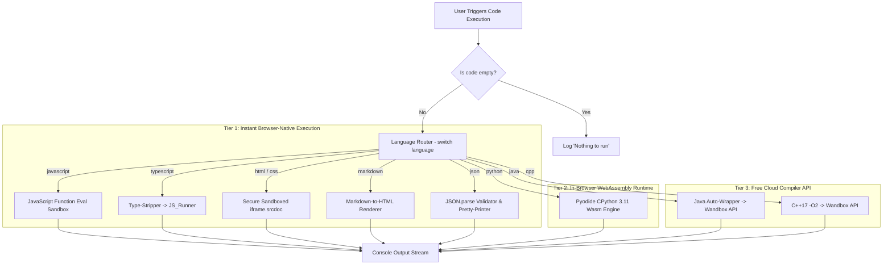
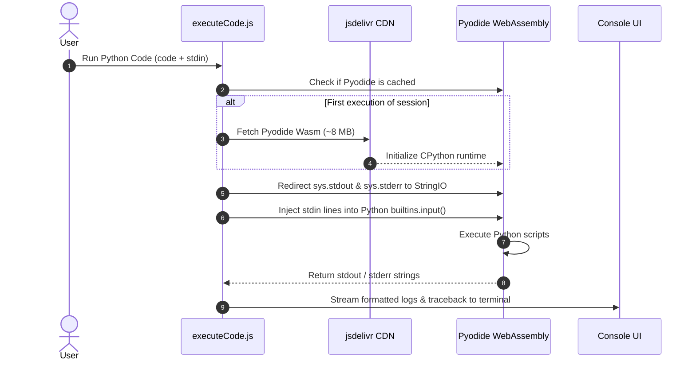
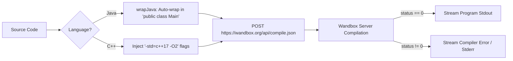

# 04. Multi-Language Runtime & Code Execution Engine

This document explains CodeBoard's code execution engine (`src/components/editor/runtime/executeCode.js`) and how it supports instant frontend execution, WebAssembly Python, and cloud-compiled Java and C++.

---

## 1. Runtime Routing Architecture

When a user clicks **"Run"** or presses `Ctrl+Enter` / `Cmd+Enter`, `executeCode(language, code, stdin, onMessage)` routes the code to one of three execution tiers:



---

## 2. Tier 1: Instant Browser-Native Execution (0ms Latency)

### 1. JavaScript (`runJavascript.js`)
- Executes using a secure browser sandbox evaluation.
- Captures `console.log`, `console.warn`, and `console.error` calls and streams them to CodeBoard's output terminal.

### 2. TypeScript (`runTypeScript`)
- Uses regex-based type stripping to remove type annotations, interfaces, type aliases, generics, and return type colons.
- Passes the clean JavaScript code directly into `runJavascript`, allowing instant TypeScript execution without a server-side TypeScript compiler.

### 3. HTML & CSS (`createSandbox.js`, `runHtml`, `runCss`)
- Generates an isolated `iframe` with sandboxed security policies (`allow-scripts`, `allow-modals`).
- Renders the user's markup or styling dynamically in the preview drawer.

---

## 3. Tier 2: In-Browser WebAssembly Python (Pyodide)

To avoid cloud API rate limits, authentication requirements, and server crashes, CodeBoard runs Python **locally inside the user's browser tab** using **Pyodide** (CPython compiled to WebAssembly).



### Key Technical Advantages of Pyodide:
- **Zero Cost & Zero Authentication:** No API keys or backend server infrastructure required.
- **Offline Capable:** Once the ~8 MB Wasm bundle is cached by the browser, Python code executes offline.
- **Standard Library Support:** Supports `math`, `re`, `datetime`, `json`, and more.
- **Standard Input (`stdin`) Support:** CodeBoard injects `_stdin_lines` into the Pyodide environment and overrides `builtins.input()` to supply console input sequentially.

---

## 4. Tier 3: Free Cloud Compilers (Wandbox API)

For compiled languages (`Java`, `C++`), CodeBoard integrates with **Wandbox** (`wandbox.org`), a free open-source compilation platform online since 2013.



### 1. Stable Compiler Target Names (`*-head`)
- CodeBoard uses `"openjdk-head"` for Java and `"gcc-head"` for C++.
- The `*-head` target always references the latest installed compiler version on Wandbox, preventing version mismatch HTTP errors when Wandbox updates its compilers.

### 2. Java Auto-Wrapper (`wrapJava`)
- In Java, code must reside inside a class definition.
- If a beginner writes a snippet like `System.out.println("Hello World");` without boilerplate, `wrapJava(code)` automatically wraps it:
```java
// Automatically generated wrapper:
public class Main {
    public static void main(String[] args) throws Exception {
        System.out.println("Hello World");
    }
}
```
- If the user wrote a class with a different name, CodeBoard automatically renames it to `public class Main` to satisfy Wandbox's compilation requirements.

---

## 5. Execution Summary Table

| Language | Engine | Location | Latency | External API Needed? |
|---|---|---|---|---|
| **JavaScript** | Browser Sandbox | Local Tab | ~2ms | No |
| **TypeScript** | Type-Strip + Sandbox | Local Tab | ~5ms | No |
| **HTML / CSS** | Sandboxed `iframe` | Local Tab | ~10ms | No |
| **Markdown** | Regex HTML Renderer | Local Tab | ~5ms | No |
| **JSON** | `JSON.parse` | Local Tab | ~1ms | No |
| **Python** | Pyodide (Wasm CPython) | Local Tab | ~300ms | No (CDN download on first run) |
| **Java** | Wandbox (`openjdk-head`) | Remote Server | ~1.5s–3s | Yes (Free Wandbox API) |
| **C++** | Wandbox (`gcc-head`) | Remote Server | ~1.5s–3s | Yes (Free Wandbox API) |
