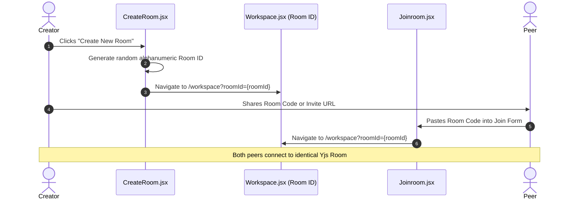
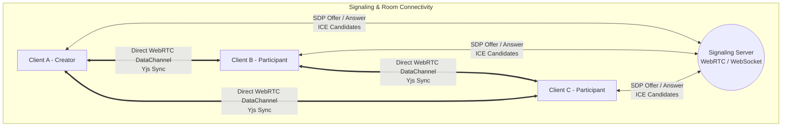
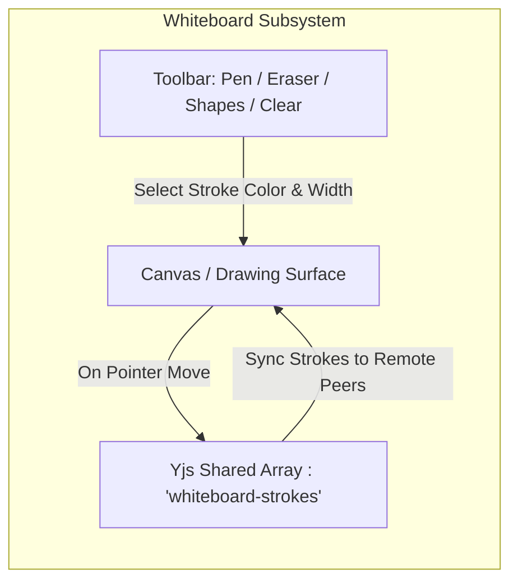

# 05. Rooms, Signaling & Whiteboard Subsystem

This document covers CodeBoard's collaborative room management, signaling architecture, and integrated collaborative whiteboard.

---

## 1. Room Creation & Joining Workflow

CodeBoard supports dynamic workspace generation where rooms are identified by unique Room IDs or shareable URLs.

### Key Components:
- **`CreateRoom.jsx` (`/create-room`):**  
  Generates a unique Room ID, allows users to configure a custom display name, and transitions to the active collaborative workspace.
- **`Joinroom.jsx` (`/join-room`):**  
  Accepts a Room ID or shareable URL, verifies that the room ID is non-empty, and redirects the peer into the target workspace.
- **`Workspace.jsx` (`/workspace`):**  
  The main container component that hosts the editor, file explorer, output console, and whiteboard, wrapping them inside `ProjectProvider(roomId)`.

---

## 2. Real-Time Signaling & Peer Connectivity

When multiple peers join the same Room ID, they discover each other via signaling servers and establish peer-to-peer data channels.

### Why WebRTC Data Channels?
- **Low Latency:** Keystrokes, cursor positions, and whiteboard strokes are transmitted directly between browsers without bouncing through a centralized database.
- **Automatic Fallback:** If restrictive firewalls block UDP peer-to-peer WebRTC connections, Yjs automatically falls back to secure WebSocket relays (`y-websocket`).

---

## 3. Collaborative Whiteboard Subsystem

CodeBoard includes an interactive whiteboard (`src/components/whiteboard/`) for sketching architecture diagrams, algorithms, and system designs alongside code.

### Capabilities of the Whiteboard Module:
- **Shared Stroke Array:** Drawing actions are serialized into vector stroke coordinates and synchronized via Yjs.
- **Tool Palette:** Provides Freehand Pen, Eraser, Line, Rectangle, Circle, and Color Picker tools.
- **Split-Screen Support:** Developers can view the Monaco Code Editor on the left and the Collaborative Whiteboard on the right simultaneously.
